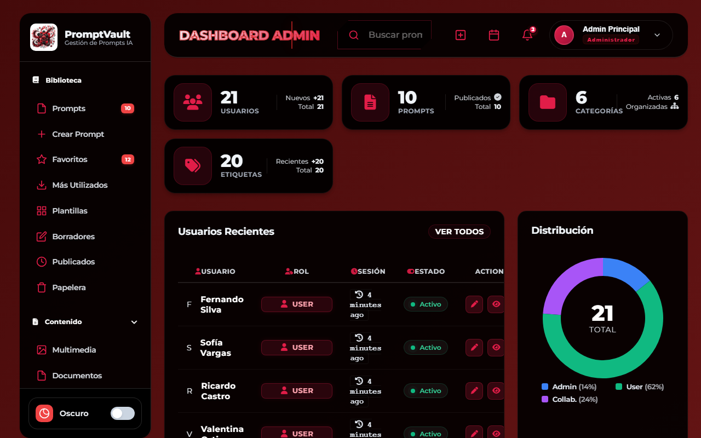
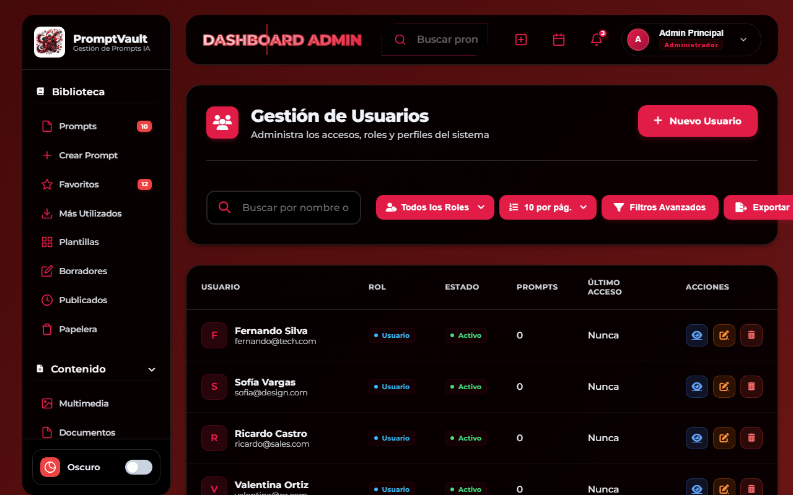
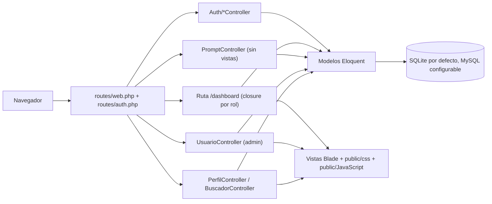
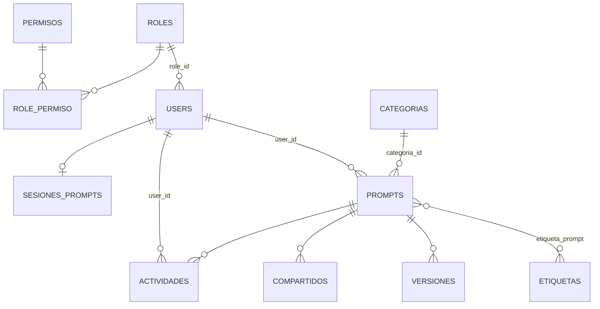

<div align="center">
  
  <h1>SystemPrompt (PromptVault)</h1>
  <p><b>Base en Laravel 12 para una biblioteca personal de prompts de IA con categorías, etiquetas, versiones y roles: el modelo de datos y el panel de usuarios funcionan; la pantalla de prompts es funcional pero mínima.</b></p>
  
  
  
  
  
  <p>
    <a href="#-inicio-rápido">Inicio rápido</a> ·
    <a href="#-características">Características</a> ·
    <a href="#-arquitectura">Arquitectura</a> ·
    <a href="#-pruebas">Pruebas</a> ·
    <a href="#-lo-que-todavía-no-existe">Limitaciones</a>
  </p>
</div>

SystemPrompt es una aplicación Laravel 12 cuya interfaz se llama **PromptVault**: un gestor de prompts para modelos de IA (título, contenido, categoría, etiquetas, IA de destino, favoritos, versiones, uso compartido) con cuatro roles (`admin`, `user`, `collaborator`, `guest`). **No es** todavía una plataforma usable de punta a punta: el CRUD de prompts ya tiene vistas mínimas y guarda versiones correctamente, pero falta pulir la interfaz. Lo que sí funciona hoy es el acceso, el tablero por rol y la gestión de usuarios del administrador.

## 🎬 Vista rápida

Capturas reales tomadas ejecutando el proyecto en local (SQLite y datos de los seeders del repo).

| Tablero de administrador | Gestión de usuarios (`/admin/usuarios`) |
|:---:|:---:|
|  |  |

> El menú lateral muestra muchas secciones (Plantillas, Borradores, Multimedia, ...) que hoy son enlaces vacíos (`href="#"`). Solo "Prompts", "Crear Prompt" y "Usuarios" apuntan a rutas reales, y ya responden (con vistas mínimas).

## ✨ Características

| Característica | Detalle |
|---|---|
| Autenticación | Login, registro y recuperación de contraseña con controladores propios (`Auth/LoginController`, `RegisterController`, `ForgotPasswordController`) y rutas `guest`/`auth`. En `.env.example` el correo va al log (`MAIL_MAILER=log`). |
| Roles y permisos | Tablas `roles`, `permisos` y `role_permiso`; roles sembrados `admin`, `user`, `collaborator`, `guest`. Gates `admin` y `gestionar-usuarios`; el grupo `/admin/*` exige `can:admin`. |
| Tablero por rol | `/dashboard` calcula estadísticas distintas para admin (usuarios, prompts, categorías, etiquetas, gráfico de distribución), usuario/colaborador (sus prompts) e invitado (prompts públicos). |
| Gestión de usuarios (admin) | CRUD de `/admin/usuarios` con búsqueda, filtro por rol, paginación y modales de confirmación. |
| Perfil | Ver y editar perfil, cambiar contraseña y subir avatar (`/perfil`). |
| Modelo de prompts | Prompts con categoría, etiquetas (N:M), versiones, actividad y registros de "compartido" con token, tipo de acceso y expiración. `PromptController` implementa favoritos, contador de uso, compartir, historial y restaurar versión (con vistas mínimas de listado, alta, edición, detalle e historial). |
| Buscador | Endpoint AJAX `GET /buscador/search` que busca en prompts (más de 2 caracteres). La página `/buscador` lista prompts propios o públicos, categorías y etiquetas. |
| Datos de ejemplo | 14 migraciones y 11 seeders: 21 usuarios, 10 prompts, 6 categorías (Programación, Redacción, Análisis de datos, Marketing, Educación, Diseño), 20 etiquetas, versiones, actividad y compartidos. |
| Documentación interna | `docs/01`–`06`: estructura de BD, modelos y relaciones, roles y permisos, datos de ejemplo, credenciales de desarrollo y comandos. |

## 🏗️ Arquitectura





<details>
<summary>Estructura de carpetas</summary>

```text
SystemPrompt/
├── app/
│   ├── Http/Controllers/        # Auth/, Prompt, Usuario, Perfil, Buscador, Calendario, Configuraciones, Reportes, Role, Permisos
│   ├── Models/                  # User, Role, Permiso, Prompt, Categoria, Etiqueta, Version, Compartido, Actividad, SesionPrompt, ...
│   ├── Policies/PromptPolicy.php
│   └── Providers/AppServiceProvider.php   # Gates admin y gestionar-usuarios
├── database/{migrations,seeders}
├── resources/views/             # admin/, auth/, calendario/, configuraciones/, perfil/, layouts/, ...
├── public/{css,JavaScript}      # estilos y scripts por pantalla
├── routes/{web.php,auth.php}
├── tests/                       # plantilla de Laravel Breeze
└── docs/                        # guías 01-06 y este README
```

</details>

## 🚀 Inicio rápido

| Requisito | Versión |
|---|---|
| PHP | 8.2 o superior (probado con 8.5.6) |
| Composer | 2.x |
| Base de datos | SQLite (por defecto) o MySQL |
| Node.js | Solo si vas a compilar assets con Vite (`npm run build`); no fue necesario para las capturas |

Verificado: migra y siembra sin errores con SQLite.

```bash
composer install
cp .env.example .env
php artisan key:generate
touch database/database.sqlite      # en Windows: type nul > database\database.sqlite
php artisan migrate --seed
php artisan serve
```

Las cuentas de demostración las crea `database/seeders/UserSeeder.php` y se listan en `docs/05_CREDENCIALES.md` (correos de ejemplo `@promptvault.com` para los administradores). Son datos de prueba: cambia las contraseñas si el servidor es accesible desde fuera.

<details>
<summary>Variables de entorno relevantes (.env.example)</summary>

| Variable | Valor por defecto |
|---|---|
| `DB_CONNECTION` | `sqlite` (para MySQL descomentar `DB_HOST`, `DB_PORT`, `DB_DATABASE`, `DB_USERNAME`, `DB_PASSWORD`) |
| `MAIL_MAILER` | `log` |

</details>

Con PHP 8.5 pueden aparecer avisos `Deprecated` de `PDO::MYSQL_ATTR_SSL_CA` provenientes de `config/database.php`; no impiden usar la app.

## 🧪 Pruebas

Hay 28 tests que pasan con `php artisan test` (SQLite en memoria): autenticación, registro, perfil, páginas de prompts, versiones y buscador. Se retiraron los tests de plantilla de Breeze para verificación de correo, confirmación y restablecimiento de contraseña porque esas rutas no existen en esta app. No hay CI.

## 🔒 Seguridad

Implementado: contraseñas hasheadas, validación en formularios, protección CSRF de Laravel, rutas de administración detrás de `auth` y del gate `admin`; con `MAIL_MAILER=log` no se envía correo real.

Avisos:

- Las cuentas sembradas comparten una contraseña de demostración documentada en el repo.
- El repo incluye un archivo de avatar subido (`public/uploads/profile/profile_1_*.jpg`); evita versionar cargas de usuarios.
- Las rutas de `roles` y `permisos` (controladores y vistas existentes) no están registradas, así que hoy no son accesibles.

## 🚧 Lo que todavía no existe

- Calendario: el controlador solo devuelve vistas vacías; `store`, `update` y `destroy` sin lógica.
- Configuraciones: las secciones son vistas estáticas; el guardado no persiste ajustes.
- Roles, permisos, reportes y respaldos: controladores/vistas presentes pero sin rutas. `ReportesController` habla de estudiantes, docentes, materias y calificaciones (resto de un proyecto académico anterior), y el tablero de usuarios/colaboradores deja variables `misMaterias` y `horarioHoy` vacías.
- La descripción anterior del repositorio lo presentaba como "plataforma educativa" con calendario y estadísticas por rol; en el código solo hay tablero por rol, y lo educativo son restos de otro proyecto.
- Menú lateral con ~26 enlaces `#` sin destino.
- Sin API, sin integración con proveedores de IA, sin CI.

## 📄 Licencia

El repo no incluye archivo `LICENSE` (`composer.json` hereda `MIT` de la plantilla de Laravel, sin texto de licencia). Se considera **sin licencia definida**: todos los derechos reservados por defecto.

<div align="center">
  <sub>Hecho por Luiss2080 · SystemPrompt / PromptVault</sub>
</div>
